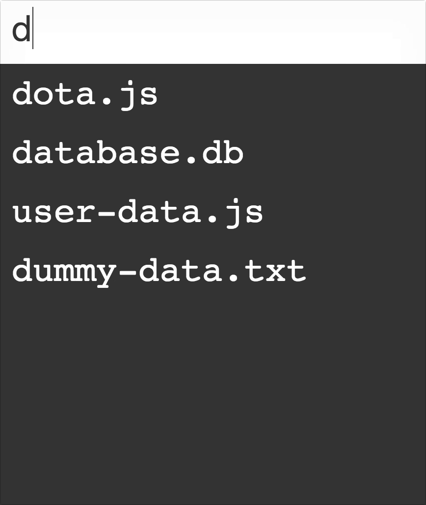

<div align="center">
  
</div>

# fuzzy-finder

> Tiny fuzzy searcher (Under 300 bytes gzipped)

[](https://npmjs.org/package/fuzzy-finder)
[](https://npmjs.org/package/fuzzy-finder)
[](https://github.com/feross/standard)
[](https://travis-ci.org/tiaanduplessis/fuzzy-finder)
[](https://github.com/tiaanduplessis/fuzzy-finder/blob/master/LICENSE)
[](http://makeapullrequest.com)
[](https://greenkeeper.io)

## Table of Contents

- [fuzzy-finder](#fuzzy-finder)
  - [Table of Contents](#table-of-contents)
  - [Install](#install)
  - [Usage](#usage)
  - [Contributing](#contributing)
  - [License](#license)

## Install

```sh
$ npm install fuzzy-finder
# OR
$ yarn add fuzzy-finder
```

Or with CDN:

```html
<script src="https://unpkg.com/fuzzy-finder@1.0.4/dist/fuzzy-finder.umd.js"></script>
```

## Usage

```js
import fuzzyFinder from 'fuzzy-finder'

console.log(fuzzy('da', [
    'dota.js',
    'stratures.js',
    'structures.js',
    'database.db',
    'user-data.js',
    'dummy-data.txt',
    'other.js'
]))
// [ { match: 'dota.js', rank: 0 },
//   { match: 'database.db', rank: 0 },
//   { match: 'user-data.js', rank: 5 },
//   { match: 'dummy-data.txt', rank: 0 } ]
```

Check out the example [here](https://codepen.io/tiaan/full/ayYZaM/).

## Contributing

Contributions are welcome!

1. Fork it.
2. Create your feature branch: `git checkout -b my-new-feature`
3. Commit your changes: `git commit -am 'Add some feature'`
4. Push to the branch: `git push origin my-new-feature`
5. Submit a pull request :D

Or open up [a issue](https://github.com/tiaanduplessis/fuzzy-finder/issues).

## License

Licensed under the MIT License.
