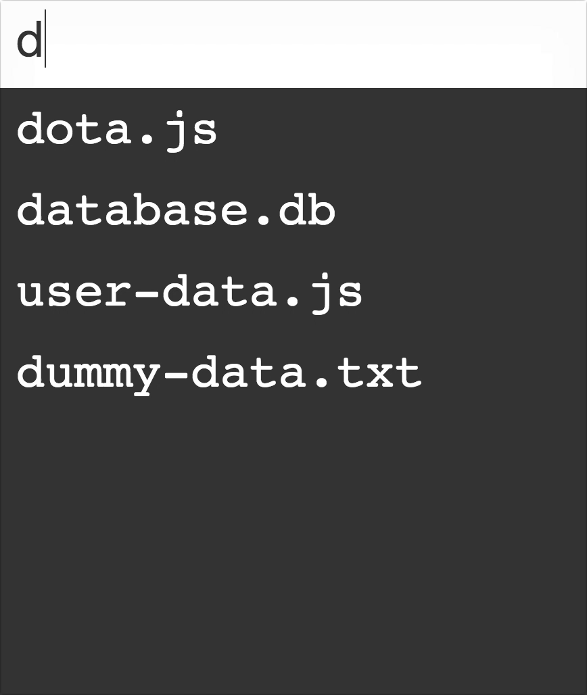

<div align="center">
  
</div>

# fuzzy-finder

> Tiny fuzzy searcher

[](https://npmjs.org/package/fuzzy-finder)
[](https://npmjs.org/package/fuzzy-finder)
[](https://eslint.org/)
[](https://travis-ci.org/tiaanduplessis/fuzzy-finder)
[](https://github.com/tiaanduplessis/fuzzy-finder/blob/master/LICENSE)
[](http://makeapullrequest.com)
[](https://greenkeeper.io)

## Table of Contents

- [fuzzy-finder](#fuzzy-finder)
  - [Table of Contents](#table-of-contents)
  - [Install](#install)
  - [Usage](#usage)
  - [Contributing](#contributing)
  - [License](#license)

## Install

```sh
$ npm install fuzzy-finder
# OR
$ yarn add fuzzy-finder
```

Or with CDN:

```html
<script src="https://unpkg.com/fuzzy-finder@1.0.4/dist/fuzzy-finder.umd.js"></script>
```

## Usage

```js
import fuzzyFinder from 'fuzzy-finder'

console.log(fuzzy('da', [
    'dota.js',
    'stratures.js',
    'structures.js',
    'database.db',
    'user-data.js',
    'dummy-data.txt',
    'other.js'
]))
// [ { match: 'dota.js', rank: 0 },
//   { match: 'database.db', rank: 0 },
//   { match: 'user-data.js', rank: 5 },
//   { match: 'dummy-data.txt', rank: 0 } ]
```

Check out the example [here](https://codepen.io/tiaan/full/ayYZaM/).

Queries are literal, case-sensitive subsequences. Punctuation such as `.`, `+`,
`[` and `\` is matched as text, not as regular-expression syntax:

```js
fuzzyFinder('a.b', ['ab', 'acb', 'xa--.--b', 'a.b'])
// [ { match: 'xa--.--b', rank: 1 }, { match: 'a.b', rank: 0 } ]
```

Results retain candidate order, including duplicates. `rank` is the zero-based
UTF-16 offset of the first matched character. Query characters can have gaps
between them, but those gaps do not cross line breaks. An empty query matches
every candidate at rank `0`.

## Development

Use Node.js 22.13+ or 24 LTS to work on this repository. The published CommonJS,
ES module and UMD entry points and the runtime dependency remain unchanged.

```sh
npm ci --ignore-scripts
npm test
```

ESLint with ESLint Stylistic retains the two-space, single-quote, no-semicolon
style.

`npm test` checks formatting without changing files, rebuilds every distribution
format, and runs the Node.js test runner. `npm run build` generates the three
minified files and source maps in `dist`. Commit those generated files with source
changes. There are no TypeScript sources or declarations to type-check.

Installation does not install Git hooks or trigger a build. `prepack` builds the
package when a maintainer explicitly packs it; no release or publishing automation
is configured by this project.

Both lockfiles are retained. `package-lock.json` is the canonical npm lockfile;
`yarn.lock` supports Yarn Classic 1.22.22 users. Update both together, inspect the
resolved graph with scripts disabled, and verify a clean install using each:

```sh
npm ci --ignore-scripts
npm test
yarn install --frozen-lockfile --ignore-scripts
yarn test
```

Do not use an unfrozen install as a substitute for these checks. Run the Yarn
check in a separate clean checkout so npm and Yarn do not share `node_modules`.

npm 10/11 may rewrite the sibling `yarn.lock` during `npm ci`, dropping optional
packages for other platforms even though `package-lock.json` is unchanged. Do
not commit that incidental Yarn rewrite. Retain the full committed Yarn lock for
cross-platform installs. For dependency updates, generate the npm lock first,
copy it and `package.json` to a temporary directory, convert the copy with
`npm install --package-lock-only --lockfile-version=1 --ignore-scripts`, and use
`yarn import --ignore-scripts` there. Bring back only the resulting `yarn.lock`
and compare package versions/integrities across both locks before testing.

## Contributing

Contributions are welcome!

1. Fork it.
2. Create your feature branch: `git checkout -b my-new-feature`
3. Commit your changes: `git commit -am 'Add some feature'`
4. Push to the branch: `git push origin my-new-feature`
5. Submit a pull request :D

Or open up [a issue](https://github.com/tiaanduplessis/fuzzy-finder/issues).

## License

Licensed under the MIT License.
